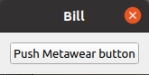
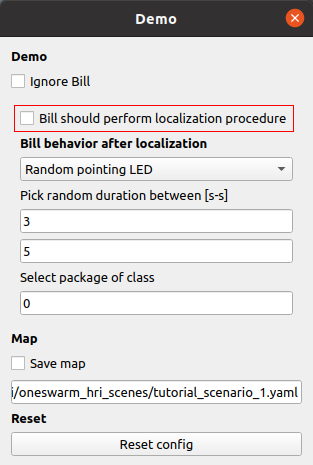

### How to deploy our Pointing User Interface (PUI)
This readme explains how to run our PUI in different scenarios, both simulated and real.
For the simulated scenarios, we provide CoppeliaSim scenes and instruction to run them. For real
world scenarios, we provide all the software needed to reproduce our setup.
All components and drivers needed are released as docker containers, to facilitate the setup.
Dockerfiles provides a convenient list of steps to rebuild the environment manually, if needed.

# Installation

1. Install [docker](https://docs.docker.com/get-docker) and [docker-compose](https://docs.docker.com/compose/install/)
2. Clone this repository locally.
3. Step into the `docker` folder and then in each subfolder to pull the container for each component.
   ```
   cd REPO_ROOT_FOLDER
   cd docker/pointing-user-interface
   sudo docker-compose -f scenario_1_sim.yaml pull
   cd ../simulation
   sudo docker-compose pull
   cd ../real_world
   sudo docker-compose pull
   ```
Note that those containers were tested on Ubuntu 18.04 and 20.04 host machines running docker `20.10.7`. They should work out of the box with other
OS, except for `simulation` one, which may need to be adapted to work with the GUI.

## Source Code
The source code can be found in [docker/pointing-user-interface/code](docker/pointing-user-interface/code/) along with the documentation to launch the ROS2 nodes for the PUI directly.
## Hardware
Here is a list of the hardware used in our real world scenarios, in case one wants to replicate them.
### IMU
We use [mbientlab MetaMotionR](https://mbientlab.com/metamotionr/), an IMU sensor with bluetooth connection. The MAC address of the device should be changed in the file [docker/real_world/_main.launch](docker/real_world/_main.launch) to match the one in use.
### LED Strips
For the LED strips used to provide feedback for pointing and packages state, we use an [ElectroMage Pro](https://www.bhencke.com/serial-led-driver-pro) board. Each LED strips must be connected to it (each plug corresponds to a channel which must be consistent with the [LED map](#3---environment-and-objects-maps)). The board must be connected via UART to a PC running our docker container. The correct device must be specified in the [docker-compose file](docker/real_world/docker-compose.yml#L28).
### Single LEDs
For those, we use [FeatherS2](https://feathers2.io/) boards flashed with [ROS2-compatible firmware](https://github.com/jeguzzi/micro_ros_feather_s2.git).
They should connect to the same network of the machine running our docker container.
### Drivers
To replicate our hardware setup, we provide containers for `metawear_ros`, `single_LEDs`
and `LED_strips` ROS2 drivers. Of course those could be replaced with different hardware, but is important that they expose the same information or interface. In particular:
* `metawear_ros` can be replaced with any IMU providing a continuous stream of `geometry_msgs/msg/QuaternionStamped` messages (see [PUI interface](#2---users-pointing-rays))
* `single_LED` controller must accept a topic named `/led_<number>/color` of type `std_msgs/msg/ColorRGBA`
* `LED_strips` controller must accept a topic named `/led_strips` of type `led_strips_msgs/msg/LedStrips` (check the [source code](docker/pointing-user-interface/code/led_strip_msgs/msg/LedStrips.msg) for details of the custom ROS messages involved)
 
# PUI Interface
Our PUI interface has 3 inputs:
1. user's position in the `world` reference frame
2. user's pointing rays in `user` reference frame
3. updated map of the environment and of the objects in it

Thanks to **1**, it can intersect **2** with **3** and produce its only output:
* list of selected objects
## 1 - User's Position
This can be given a priori or computed/tracked. In our code, we provide configurations both to fix it
and to compute it through our relative localization (_relloc_) approach. In general, it must be published
as a `tf_transform` between two frames: `world` and `user_namespace/human_footprint`.

Our relloc works as follows:
* All single LEDs are turned off. We know their position in the world thanks to the map.
* First LED turns on. We assume the user is pointing at it. We collect user's pointing rays.
* First LED turns off. Second LED turns on. We assume the user is pointing at it. We collect user's pointing rays.
* Second LED turns off. 
* By matching pointing rays (in user's frame) with pointed LEDs (in world frame), we are able to compute
  the relative localization.
  
## 2 - User's Pointing Rays
We provide a head-finger pointing model in our code. The only thing needed to compute pointing
rays is a topic publishing `geometry_msgs/msg/QuaternionStamped` which name must be passed to our
launch file. This corresponds to an IMU sensor tracking the arm orientation of the user, that we
use to move user's shoulder joint and compute the pointing ray as the ray originating between user's eyes
and passing through their index fingertip.

Note that user biometry may be updated to obtain a more accurate pointing reconstruction. To do so,
edit the [human_kinematics.yaml](docker/pointing-user-interface/human_kinematics.yaml) file accordingly in `docker/pointing-user-interface/`.

## 3 - Environment and Objects Maps
The environment map is used to intersect pointing rays with the system. In that way we can understand if the user is pointing at a given object within the environment and also provide a feedback cursor, so that they know where the system thinks they are pointing.

In our examples, objects to select are packages (or packages simulated on LED strips), moving on conveyor belts. So we need maps of those belts and LED strips, while we keep publishing the updated position of the packages.

The map gives us also the known position of the single LEDs used for the relative localization.

This is the format of our maps.
If there are no belts but strips, it is implicitly assumed that belts are emulated on the strips, i.e., for every strip there is a belt with the same geometry, named `strip_<uid>`.

```yaml
belts:
  <name>:
    centerline: [[<x>, <y>, <z>], ..., [<x>, <y>, <z>]] # [floats, in m]
    width: <width>  # [float, in m]
    length: <length>  # optional, [float, in m]
leds:
  <name>:  # [string]
    position: [<x>, <y>, <z>] # floats in m
strips:
  <uid>: # equal to the channel id [int]
    pixels: <pixels> # number of LEDs [int]
    direction: <direction> # 1 (first pixel in line[0]) or -1 (last pixel in line[0])
    line: [[<x>, <y>, <z>], ..., [<x>, <y>, <z>]]  #  [floats, in m]
    name: <name>  # [string]
```


# Usage in Different Scenarios
We have four different scenarios, which can be launched both in simulation and real world, 
using the same [launch file](docker/pointing-user-interface/code/relloc/launch/docker_hri.launch). So, for each scenario we will provide a brief description, then we will point
the relevant CoppeliaSim scene, environment map and launch parameters. 

### General Interaction
In general, those are the steps for each scenario:
1. Idle.
2. Press button. Triggers relloc (if enabled) or set the localization (if fixed)
3. Localization is computed/fixed
4. User is attached to PUI (e.g. the cursor is drawn on led strips, packages can be selected, etc.)
5. Press button.
6. User is detached from PUI, go back to 1.

### Pressing Buttons
To start and then trigger each step of the interaction, in real world we press the button on our IMU each time. In simulation, we do the same by opening Bill's GUI (after starting the simulation) and then clicking _Push metawear button_.
Here you can see the icon needed to open Bill's GUI.

 

If you can not see this small window  , it means that the scene is not playing: remember to start it before, by pressing the play button  , then open Bill's GUI again.
As an alternative, both in simulation and real world, one can press _n_ button on the keyboard to go on with the interaction, but this will work only in a single user scenario.

### Enabling Relloc
By default, all scenarios will run without relative localization. To change this behavior, open the demo GUI in CoppeliaSim by clicking the icon marked in the image and check _Bill should perform  localization procedure_ (do this before starting the scene).

  

If this option is checked, after triggering the interaction, Bill will perform the relative localization first.
Also, when launching the `pointing-user-interface` container, set the environment variable `DO_RELLOC=True`, like this:
 ```
DO_RELLOC=True docker-compose -f scenario_<number>_<sim or real>.yaml up
```

## Scenario 1 - Single LEDs

In scenario 1 users, once localized, can point at a set of single LED lights and change their color.
The color will be mapped to a specified colormap according to how close the pointing ray is to the light.

### Simulation
First, launch CoppeliaSim container, if it is not running already:
```
cd REPO_ROOT_FOLDER
cd docker/simulation
xhost +local:root # otherwise the GUI won't work
sudo docker-compose up
```
Then, from CoppeliaSim top-bar menu, click `File -> Open scene...` , navigate to `/ros_ws/src/coppelia_scenes/` and open `tutorial_scenario_1.ttt`.

If you want to run the relative localization, do [this](#enabling-relloc).

Then, press the `play` button () in CoppeliaSim to start the scene. 

After this, start the PUI nodes:
```
cd REPO_ROOT_FOLDER
cd docker/pointing-user-interface
sudo docker-compose -f scenario_1_sim.yaml up
# or, if you want to perform relloc (remeber to set also the demo GUI in Coppelia)
sudo DO_RELLOC=True docker-compose -f scenario_1_sim.yaml up
```
Finally, start the interaction by pressing the virtual-metawear button as described [here](#interaction).

### Real World
First, launch all the drivers for the real world scenarios:
```
cd REPO_ROOT_FOLDER
cd docker/real_world
sudo USER_NAME=human docker-compose up
```
The `USER_NAME` variable is needed to define different user namespaces in case multiple users are interacting with the PUI.

Then, launch the relevant docker compose:
```
cd REPO_ROOT_FOLDER
cd docker/pointing-user-interface
sudo docker-compose -f scenario_1_real.yaml up
# or, if you want to perform relloc
sudo DO_RELLOC=True docker-compose -f scenario_1_real.yaml up
```
Start the interaction by pressing the metawear button.

## Scenario 2 - Pointing Cursor on LED Strips

In scenario 2 users, once localized, can point along the LED strips to draw a pointing cursor.
The color of this cursor is mapped to a specified colormap according to how close the pointing ray is to the strip.

### Simulation
First, launch CoppeliaSim container, if it is not running already:
```
cd REPO_ROOT_FOLDER
cd docker/simulation
xhost +local:root # otherwise the GUI won't work
sudo docker-compose up
```
Then, from CoppeliaSim top-bar menu, click `File -> Open scene...` , navigate to `/ros_ws/src/coppelia_scenes/` and open `tutorial_scenario_2.ttt`.

If you want to run the relative localization, do [this](#enabling-relloc).

Then, press the `play` button () in CoppeliaSim to start the scene. 

After this, start the PUI nodes:
```
cd REPO_ROOT_FOLDER
cd docker/pointing-user-interface
sudo docker-compose -f scenario_2_sim.yaml up
# or, if you want to perform relloc (remeber to set also the demo GUI in Coppelia)
sudo DO_RELLOC=True docker-compose -f scenario_2_sim.yaml up
```
Finally, start the interaction by pressing the virtual-metawear button as described [here](#interaction).

### Real World
First, launch all the drivers for the real world scenarios:
```
cd REPO_ROOT_FOLDER
cd docker/real_world
sudo USER_NAME=human docker-compose up
```
The `USER_NAME` variable is needed to define different user namespaces in case multiple users are interacting with the PUI.

Then, launch the relevant docker compose:
```
cd REPO_ROOT_FOLDER
cd docker/pointing-user-interface
sudo docker-compose -f scenario_2_real.yaml up
# or, if you want to perform relloc
sudo DO_RELLOC=True docker-compose -f scenario_2_real.yaml up
```
Start the interaction by pressing the metawear button.

## Scenario 3 - Selecting Packages Simulated on LED Strips

In scenario 3 users, once localized, can select moving packages simulated along the LED strips. Packages are represented in three colors, red, green and blue.

To select a package, the pointing cursor must overlay it for 0.5s.

Selected packages are marked by two white dots flanking them. In simulation, Bill's task is to select just the red packages.

In this scenario, the pointing cursor is yellow (i.e. is not mapped to a colormap by default)

### Simulation
First, launch CoppeliaSim container, if it is not running already:
```
cd REPO_ROOT_FOLDER
cd docker/simulation
xhost +local:root # otherwise the GUI won't work
sudo docker-compose up
```
Then, from CoppeliaSim top-bar menu, click `File -> Open scene...` , navigate to `/ros_ws/src/coppelia_scenes/` and open `tutorial_scenario_3.ttt`.

If you want to run the relative localization, do [this](#enabling-relloc).

Then, press the `play` button () in CoppeliaSim to start the scene. 

After this, start the PUI nodes:
```
cd REPO_ROOT_FOLDER
cd docker/pointing-user-interface
sudo docker-compose -f scenario_3_sim.yaml up
# or, if you want to perform relloc (remeber to set also the demo GUI in Coppelia)
sudo DO_RELLOC=True docker-compose -f scenario_3_sim.yaml up
```
Finally, start the interaction by pressing the virtual-metawear button as described [here](#interaction).

### Real World
First, launch all the drivers for the real world scenarios:
```
cd REPO_ROOT_FOLDER
cd docker/real_world
sudo USER_NAME=human docker-compose up
```
The `USER_NAME` variable is needed to define different user namespaces in case multiple users are interacting with the PUI.

Then, launch the relevant docker compose:
```
cd REPO_ROOT_FOLDER
cd docker/pointing-user-interface
sudo docker-compose -f scenario_3_real.yaml up
# or, if you want to perform relloc
sudo DO_RELLOC=True docker-compose -f scenario_3_real.yaml up
```
Start the interaction by pressing the metawear button.

## Scenario 4 - Selecting Packages On a Conveyor Belt
In scenario 4 users, once localized, can select packages moving along a conveyor belt. Here, LED strips provide feedback only for the position and the selection of packages, not their nature/color. In fact, they are all represented on the strips as blue. This happens because the system can track only the position of the moving boxes, but does not know whether they are defected (i.e. red packages). User/Bill's task is to select all the red packages so that they can be dispatched in the first bay, while all unselected packages are diverted towards the 3rd one.

Again, to select a package, the pointing cursor must overlay it for 0.5s.

Selected packages are marked by two white dots flanking them.

In this scenario, the pointing cursor is yellow (i.e. is not mapped to a colormap by default)

### Simulation
First, launch CoppeliaSim container, if it is not running already:
```
cd REPO_ROOT_FOLDER
cd docker/simulation
xhost +local:root # otherwise the GUI won't work
sudo docker-compose up
```
Then, from CoppeliaSim top-bar menu, click `File -> Open scene...` , navigate to `/ros_ws/src/coppelia_scenes/` and open `tutorial_scenario_4.ttt`.

If you want to run the relative localization, do [this](#enabling-relloc).

Then, press the `play` button () in CoppeliaSim to start the scene. 

After this, start the PUI nodes:
```
cd REPO_ROOT_FOLDER
cd docker/pointing-user-interface
sudo docker-compose -f scenario_4_sim.yaml up
# or, if you want to perform relloc (remeber to set also the demo GUI in Coppelia)
sudo DO_RELLOC=True docker-compose -f scenario_4_sim.yaml up
```
Finally, start the interaction by pressing the virtual-metawear button as described [here](#interaction).

### Real World
First, launch all the drivers for the real world scenarios:
```
cd REPO_ROOT_FOLDER
cd docker/real_world
sudo USER_NAME=human docker-compose up
```
The `USER_NAME` variable is needed to define different user namespaces in case multiple users are interacting with the PUI.

Then, launch the relevant docker compose:
```
cd REPO_ROOT_FOLDER
cd docker/pointing-user-interface
sudo docker-compose -f scenario_4_real.yaml up
# or, if you want to perform relloc
sudo DO_RELLOC=True docker-compose -f scenario_4_real.yaml up
```
Start the interaction by pressing the metawear button.

Note that this will launch only the PUI software, we don't include the software to control the conveyor belt system. In general, one would need to interface with it and get a list of all the packages and their positions. We were able to test our system both in VR, with the simulated conveyor, and in the real world. For the latter case, we were manually adding packages on the conveyor and in our system at the same time: knowing the belt speeds, we were able to estimate their positions and run the interaction.


https://user-images.githubusercontent.com/20441485/137182141-58fb2eef-0d3f-41a2-a229-9be4fabd2d6b.mp4

