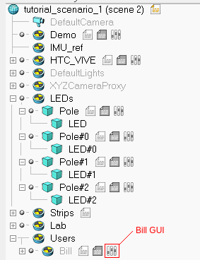
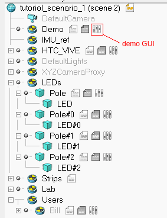

### How to deploy our Pointing User Interface (PUI)
This readme explains how to run our PUI in different scenarios, both simulated and real.

For the simulated scenarios, we provide CoppeliaSim scenes and instruction to run them. For real
world scenarios, we provide all the software needed to reproduce our setup.

All components and drivers needed are released as docker containers, to facilitate the setup.
Dockerfiles will provide a convenient list of steps to rebuild the environment manually.

#Installation

1. Install [docker](https://docs.docker.com/get-docker) and [docker-compose](https://docs.docker.com/compose/install/)
2. Step into the `docker` folder and then in each subfolder to pull the container for each component.
For example:
   ```
   cd docker/coppelia
   docker-compose pull
   ```
Note that those containers were tested on Ubuntu 20.04. They should work out of the box with other
OS, except for `coppelia` one, which may be adapted to work with the GUI.

###Source Code
The source code can be found in `docker/oneswarm_hri/oneswarm-hri`.
###Drivers
To replicate our hardware setup (i.e. IMU source, LEDs), we provide containers for `metawear`, `single_LEDs`
and `LED_strips` ROS2 drivers. Of course those could be replaced with different hardware, but is important that
they expose the same information or interface. In particular:
* `metawear` can be replaced with any IMU and must provide a continuous stream of quaternions (see PUI interface)
* `single_LED` controller must expose a topic named `/led_number/color` of type `std_msgs/msg/ColorRGBA`
* `LED_strips` controller must expose a topic named `/led_strips` of type `led_strips_msgs/msg/LedStrips` (check the
  source code for details)
  
#PUI Interface
Our PUI interface has 3 inputs:
1. user's position in the `world` reference frame
2. user's pointing rays in `user` reference frame
3. updated map of the environment and of the objects in it

Thanks to **1**, it can intersect **2** with **3** and produce its only output:
* list of selected objects
###1 - User's Position
This can be given a priori or computed/tracked. In our code, we provide configurations both to fix it
and to compute it through our relative localization (relloc) approach. In general, it must be published
as a `tf_transform` between two frames: `world` and `user_namespace/human_footprint`.

Our relloc works as follows:
* All single LEDs are turned off. We know their position in the world thanks to the map.
* First LED turns on. We assume the user is pointing at it. We collect user's pointing rays.
* First LED turns off. Second LED turns on. We assume the user is pointing at it. We collect user's pointing rays.
* Second LED turns off. 
* By matching pointing rays (in user's frame) with pointed LEDs (in world frame), we are able to compute
  the relative localization.
  
###2 - User's Pointing Rays
We provide a head-finger pointing model in our code. The only thing needed to compute pointing
rays is a topic publishing `geometry_msgs/msg/QuaternionStamped` which name must be passed to our
launch file. This corresponds to an IMU sensor tracking the arm orientation of the user, that we
use to move user's shoulder joint and compute the pointing ray as the ray originating between user's eyes
and passing through their index fingertip.

Note that user biometry may be updated to obtain a more accurate pointing reconstruction. To do so,
edit the human_kinematics.yaml file accordingly in`docker/oneswarm-hri`

###3 - Environment and Object Maps
The environment map is used to intersect pointing rays with the system. In that way we can understand if the user
is pointing at a given object within the environment and also provide a feedback cursor, so that they know
where the system thinks they are pointing.

In our examples, objects to select are packages (or packages simulated on LED strips), moving on conveyor belts.
So we need maps of those belts and LED strips, while we keep publishing the updated position of the packages.

This is the format of our maps.
If there are no belts but strips, it is implicitly assumed that belts are emulated on the strips, i.e., for every strip there is a belt with the same geometry, named `strip_<uid>`.

```yaml
belts:
  <name>:
    centerline: [[<x>, <y>, <z>], ..., [<x>, <y>, <z>]] # [floats, in m]
    width: <width>  # [float, in m]
    length: <length>  # optional, [float, in m]
leds:
  <name>:  # [string]
    position: [<x>, <y>, <z>] # floats in m
strips:
  <uid>: # equal to the channel id [int]
    pixels: <pixels> # number of LEDs [int]
    direction: <direction> # 1 (first pixel in line[0]) or -1 (last pixel in line[0])
    line: [[<x>, <y>, <z>], ..., [<x>, <y>, <z>]]  #  [floats, in m]
    name: <name>  # [string]
```


#Scenarios
We have four different scenarios, which can be launched both in simulation and real world, 
using the same launch file. So, for each scenario we will briefly explain it, then will provide
the relevant CoppeliaSim scene, environment map and launch parameter. In general, the workflow to
launch a scenario will be:

(just for simulation)
```
# first, launch CoppeliaSim
cd docker/coppelia
docker-compose up
# open the relevant scene in coppelia and start it
```
On another terminal (both for simulation and real world),
```
cd docker/oneswarm-hri
gedit docker-compose.yaml # edit the command with the relevant launch parameter
docker-compose up
```
On other terminals, `docker-compose up` for other drivers (just for real world)

To trigger the interaction, in real world we press the button on our IMU, in simulation we
open Bill's GUI (after starting the simulation) and then click _Push metawear button_.
Here you can see the icon needed to open Bill's GUI.

 

As an alternative, both in simulation and real world, one can press _n_ button on the keyboard to
go on with the interaction, but this will work only in a single user scenario.

By default, all scenarios will run without relative localization. To change this behaviour, open
the demo GUI in CoppeliaSim by clicking the icon marked in the image and check _Bill should perform 
localization procedure_.

 

If this option is checked, after triggering the interaction, Bill will perform the relative localization first.

In general, those are the steps for each scenario:
1. Idle.
2. Press button. Triggers relloc (if enabled) or set the localization (if fixed)
3. Localization is computed/fixed
4. User is attached to PUI (e.g. the cursor is drawn on led strips, packages can be selected, etc.)
5. Press button.
6. User is detached from PUI, go back to 1.


## Scenario 1 - Single LEDs

In scenario 1 users, once localized, can point at a set of single LED lights and change their color.
The color will be mapped to a specified colormap according to how close the pointing ray is to the light.

###Simulation
The scene to open from CoppeliaSim menu can be found at `/ros_ws/src/oneswarm-hri-scenes/tutorial_scenario_1.ttt`
within the docker container.

Then, edit `docker/oneswarm_hri/docker-compose.yml` command (line 8):
```
command: ros2 launch relloc docker_hri.launch single_LED:=True map_path:="/ros_ws/src/oneswarm_hri_scenes/tutorial_scenario_1.yaml" do_relloc:=False user_kinematics:="bill" sim_imu:=True rotation_topic:="imu" user_name:="user1" pointer_cmap:="viridis"
```
Change in `do_relloc:=True` to perform relative localization.

Then, launch the container:
```
cd docker/oneswarm_hri
docker-compose up
```
Start the interaction by pressing the metawear button as explained TODO:ADD REF

###Real World
Launch all the drivers containers, then edit `docker/oneswarm_hri/docker-compose.yml` command (line 8):
```
command: ros2 launch relloc docker_hri.launch single_LED:=True map_path:="/ros_ws/src/oneswarm_hri_scenes/tutorial_scenario_1.yaml" do_relloc:=False user_kinematics:="human" sim_imu:=False rotation_topic:="metawear_ros/rotation" user_name:="human" pointer_cmap:="viridis"
```
Change in `do_relloc:=True` to perform relative localization.

Then, launch the container:
```
cd docker/oneswarm_hri
docker-compose up
```
Start the interaction by pressing the metawear button as explained TODO:ADD REF